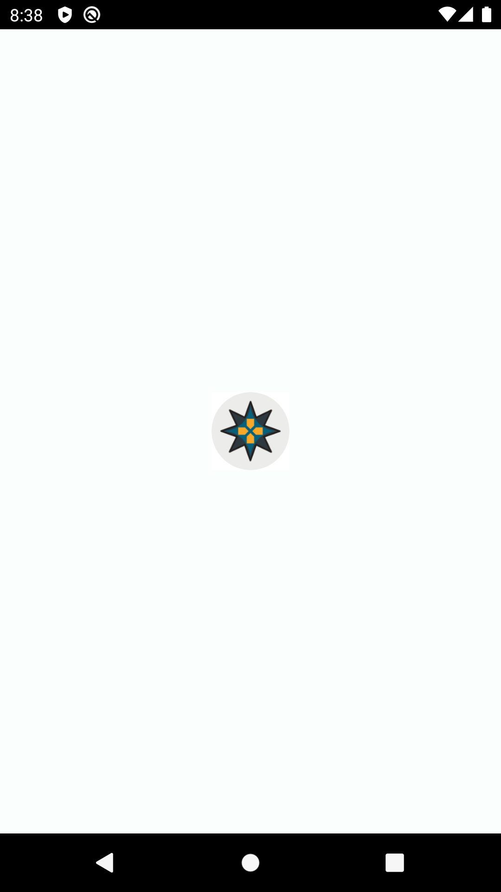
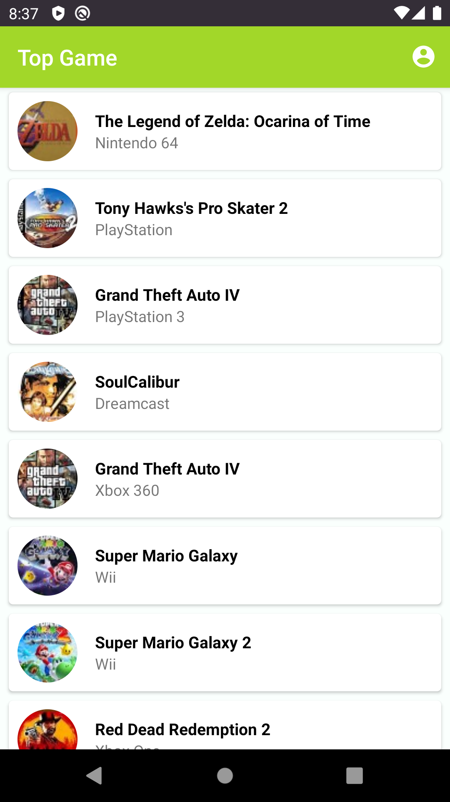
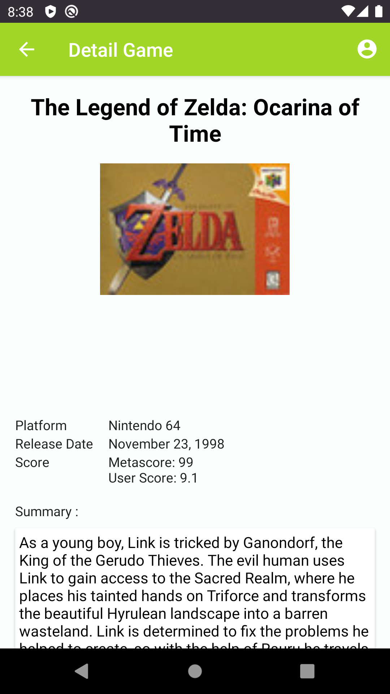
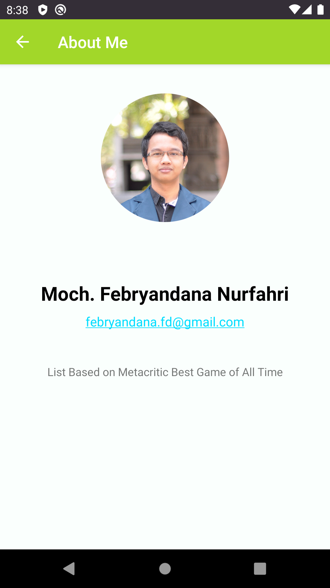

# dicoding-submission-top-games
Submission project for Dicoding course "Belajar Membuat Aplikasi Android untuk Pemula"

This is a project for learning Android and also final submission for [Dicoding](https://www.dicoding.com)

### Checklist
-  [x] Display images & information in List format with minimal 10 different items
-  [x] A detail page appears when an item is clicked
-  [x] Display relevant images & information in the detail page
-  [x] Display About page

### Screenshot





### Installation
Clone this repository and import to Android Studio
```
git clone https://github.com/febryandana/dicoding-submission-top-games.git
```

### Author
Moch. Febryandana Nurfahri (febryandana.fd@gmail.com)
